# FPGA-Based Real-Time Stereo Audio Encryption & Decryption System

A high-performance FPGA-based digital signal processing design that implements a hardware-accelerated **Real-Time Stereo Audio Encryption and Decryption pipeline** using chained **Linear-Feedback Shift Register (LFSR) Stream Ciphers** and **I2S (Inter-IC Sound) serialization/deserialization**.

---

## 🛠️ System Architecture

The design features a complete end-to-end hardware path, simulating real-world ADC-to-DAC transmission over I2S with intermediate cryptographic protection.

```mermaid
graph TD
    %% Audio Input (ADC side)
    ADC[Analog Audio In] -->|Analog| ADC_Phys[ADC Hardware]
    ADC_Phys -->|Serial I2S: adc_sdata| RX[i2s_receiver]
    
    %% Receiver Deserialization
    subgraph RX_Sub ["Receiver (16/24-bit Parallel Conversion)"]
        RX -->|24-bit Left Data| RX_L[Left Channel]
        RX -->|24-bit Right Data| RX_R[Right Channel]
    end

    %% Encryption Pipeline
    subgraph ENC_Sub ["Encryption Stage (Dual-Chained Stream Ciphers)"]
        RX_L -->|rx_left| ENC1_L["stream_cipher1 (LFSR Seed: 0xACE1)"]
        RX_R -->|rx_right| ENC1_R["stream_cipher1 (LFSR Seed: 0xACE1)"]
        
        ENC1_L -->|enc1_left| ENC2_L["stream_cipher2 (LFSR Seed: 0xBEEF)"]
        ENC1_R -->|enc1_right| ENC2_R["stream_cipher2 (LFSR Seed: 0xBEEF)"]
    end

    %% Decryption Pipeline (Symmetric XOR)
    subgraph DEC_Sub ["Decryption Stage (Dual-Chained Stream Deciphers)"]
        ENC2_L -->|enc2_left| DEC2_L["stream_cipher2 (LFSR Seed: 0xBEEF)"]
        ENC2_R -->|enc2_right| DEC2_R["stream_cipher2 (LFSR Seed: 0xBEEF)"]
        
        DEC2_L -->|dec2_left| DEC1_L["stream_cipher1 (LFSR Seed: 0xACE1)"]
        DEC2_R -->|dec2_right| DEC1_R["stream_cipher1 (LFSR Seed: 0xACE1)"]
    end

    %% Transmitter Serialization
    subgraph TX_Sub ["Transmitter (24/16-bit Parallel Conversion)"]
        DEC1_L -->|dec1_left| TX[i2s_transmitter]
        DEC1_R -->|dec1_right| TX
    end
    
    TX -->|Serial I2S: dac_sdata| DAC_Phys[DAC Hardware]
    DAC_Phys -->|Analog| DAC[Clean Audio Out]

    %% Formatting
    style ENC_Sub fill:#3f1d5e,stroke:#9f5afd,stroke-width:2px;
    style DEC_Sub fill:#1b4d3e,stroke:#39c5bb,stroke-width:2px;
    style RX_Sub fill:#2b2b2b,stroke:#888,stroke-width:1px;
    style TX_Sub fill:#2b2b2b,stroke:#888,stroke-width:1px;
```

---

## 📁 Repository Structure

* `AUDIO.xpr`: Vivado Project File.
* `AUDIO.srcs/`
  * `sources_1/new/`
    * `audio_processing.v`: Core hardware design containing design modules.
  * `sim_1/new/`
    * `tb_top.sv`: SystemVerilog testbench.

---

## ⚙️ Core Hardware Modules

### 1. I2S Receiver (`i2s_receiver`)
* **Role**: Deserializes the serial I2S input `adc_sdata` into 24-bit parallel left and right audio channels.
* **Mechanism**: Monitors bit clock (`bclk`) and left-right clock (`lrclk`). Shifts in bits MSB-first. Fires a `data_valid` flag at each frame boundary transition.

### 2. Encryption Stage 1 (`stream_cipher1`)
* **Role**: Standard Symmetric XOR stream cipher.
* **LFSR Polynomial**: $x^{32} + x^{22} + x^2 + x^1 + 1$ (Seed: `32'hACE1`).
* **Implementation**: On each valid input sample, the LFSR advances and XORs the bottom 24 bits with the incoming audio word.

### 3. Encryption Stage 2 (`stream_cipher2`)
* **Role**: Second stage of cascading encryption to increase cryptographic strength.
* **LFSR Polynomial**: $x^{32} + x^7 + x^5 + x^3 + 1$ (Seed: `32'hBEEF`).
* **Implementation**: Operates sequentially after `stream_cipher1`.

### 4. Decryption Stages (`dec2` and `dec1`)
* **Role**: Restores original clean audio.
* **Mechanism**: Because stream ciphers rely on the symmetric XOR property ($A \oplus B \oplus B = A$), passing the encrypted stream back through the identical LFSR generators in reverse order recovers the original signal.

### 5. I2S Transmitter (`i2s_transmitter`)
* **Role**: Serializes the decrypted parallel stereo stream back into standard serial I2S output (`dac_sdata`) for DAC playback.

---

## 🧪 Simulation & Verification

The SystemVerilog testbench (`tb_top.sv`) mimics real-world hardware interfaces and tests the integrity of the encryption-decryption cycle:

1. **Clock Generation**: Generates a main system clock (100 MHz), bit clock (3.072 MHz), and frame clock (48 kHz) to match real-world audio specifications (24-bit stereo at 48k sample rate).
2. **Audio File Processing**:
   * Reads signed 16-bit hexadecimal samples from `samples.txt`.
   * Left-aligns them to 24-bit parallel format (`samples << 8`).
   * Serializes the samples to feed the `adc_sdata` input.
3. **Decryption Verification**:
   * Deserializes the output `dac_sdata` back into parallel format.
   * Scales the outputs back to 16-bit and logs them into `output.txt`.

### How to Run Simulation in Vivado:
1. Open `AUDIO.xpr` in Xilinx Vivado.
2. Ensure `tb_top.sv` is set as the active simulation top.
3. Create a `samples.txt` file in the active simulation directory (e.g. `AUDIO.sim/sim_1/behav/xsim/`) populated with 16-bit hex values (one per line, alternating Left and Right).
4. Click **Run Simulation** -> **Run Behavioral Simulation**.
5. Once simulation completes, check `output.txt` in the same directory. The output samples will perfectly match the original `samples.txt` inputs, verifying bit-level decryption accuracy.

---

## 📜 License
This project is licensed under the MIT License.
